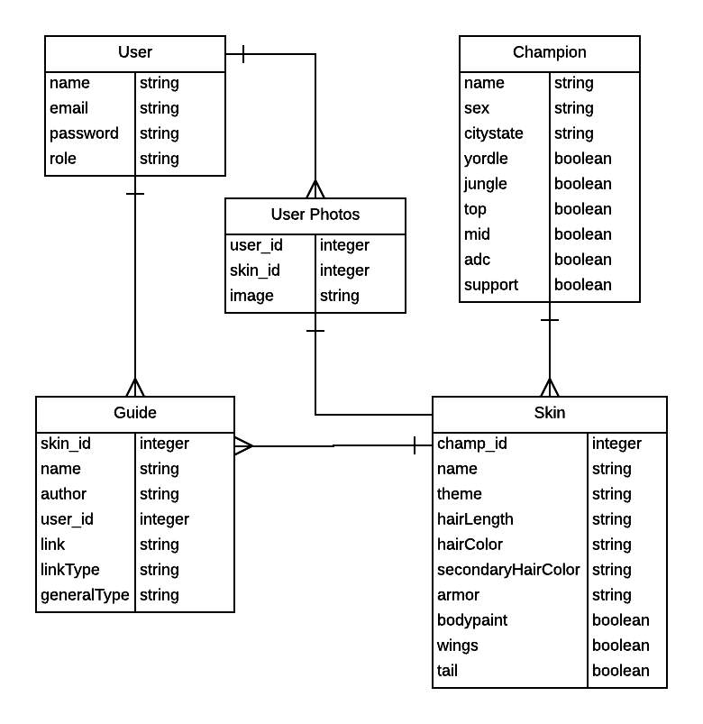

# LoLCosplay

LoLCosplay is a site designed for League of Legends cosplayers to filter through the champions and their skins by features, such as hair color and length and amount of armor, in order to choose a champion to cosplay. This feature is useful for those who have wigs used for other cosplays, those who want to make a group of champions from the same citystate, theme, or lane, etc. 

Once a champion or skin is chosen, users are able to find guides and tutorials that can help them create the costume or prop. General tutorials will be available for users who want to learn more about subjects such as adding electronics or constructing better armor. Users will be able to submit their photos to a gallery for each champion so others may use their cosplays as reference.

Future features:
	-User profile page to showcase their works and guides
	-Ability to write their own guides and host on the website, thus allowing upvote guide feature and comments

ERD:

Home Wireframe:

Champion Page Wireframe:

Themes Wireframe:

Guides Wireframe:

Gallery Wireframe:

LoLCosplay isn't endorsed by Riot Games and doesn't reflect the views or opinions of Riot Games or anyone officially involved in producing or managing League of Legends. League of Legends and Riot Games are trademarks or registered trademarks of Riot Games, Inc. League of Legends © Riot Games, Inc.